# Raven: 2 CTF Walkthrough

## Introduzione
In questo walkthrough andrò a ricoprire il minimo e indispensabile delle azioni che ho percorso per poter portare a termine la CTF.

> Premessa. Le seguenti parti sono omesse dal writeup perché vorrei che siate voi stessi a scoprire come eseguire quei passaggi (semmai voleste risolvere la CTF):
> - La parte dove farò **RCE**
> - Ottenimento della **reverseshell** coi permessi di **root**.

## Scanning
Per iniziare, ho lanciano `nmap` per scoprire un paio di informazioni riguardo l'host:

`nmap -sV -sC -T5 raven`

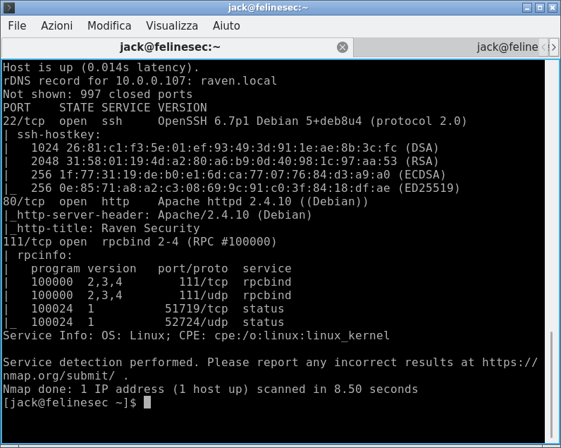

Il webserver è al quanto interessante.

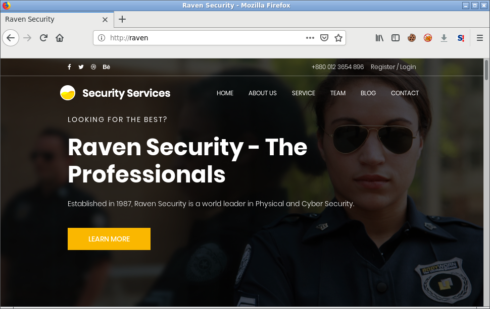

Vediamo se ci sono path da cui noi potremmo attingere informazioni.

Per quest'opreazione ho utilizzato il mio tool [Jack Web Path Finder](https://github.com/jackrendor/jwpf) con l'uso di [SecList](https://github.com/danielmiessler/SecLists), ma voi potreste utilizzare `dirsearch` o qualsiasi altro tool adatto a questo lavoro.

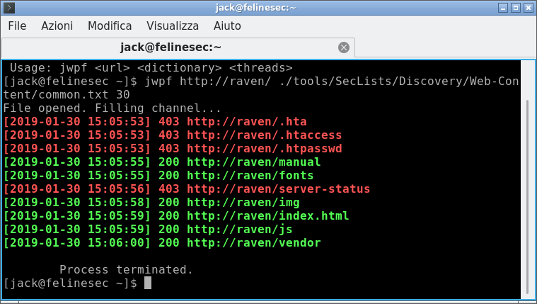

Incuriosito dal path "vendor", decido di dargli un'occhiata, trovando 3 file importanti:
- PATH che ci fornisce la prima flag
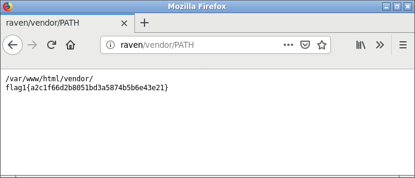
- VERSION che ci informa della versione del software (5.2.16)
- SECURITY.md che ci fornisce cortesemente una lista di vulnerabilità del software.
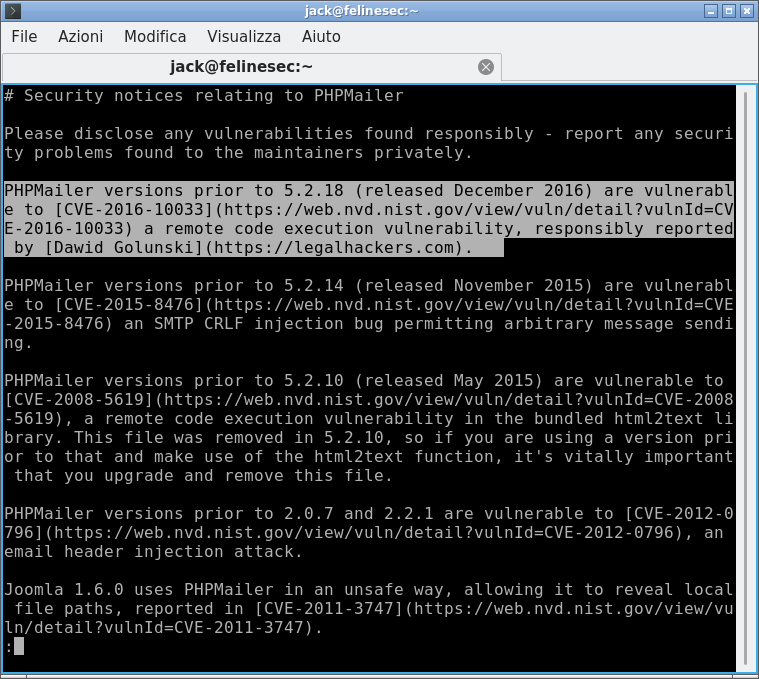

## Gaining Access
Il software che sta girando sulla macchina è vulnerabile all'ultima CVE, che permette di eseguire codice arbitrario sulla macchina (**Remote Code Execution**).

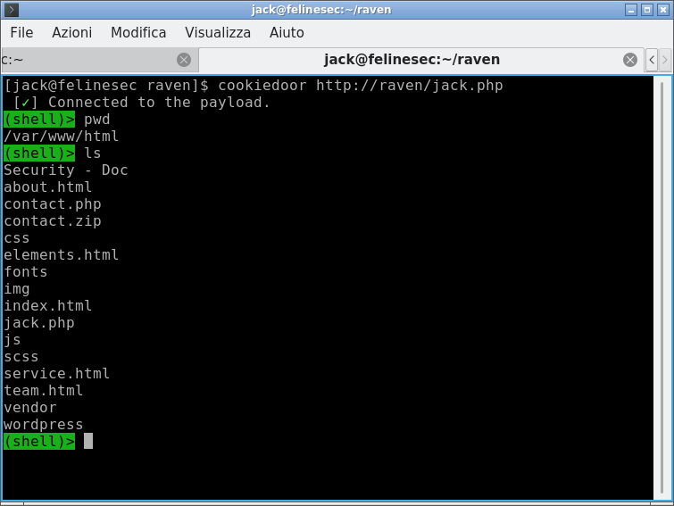

Dopo aver exploitato la macchina inserindo la mia webshell ([cookiedoor](https://github.com/jackrendor/cookiedoor), dategli un'occhiata se volete), passo all'analisi delle cartelle e dei file a cui posso accedere.

> Seconda Flag:
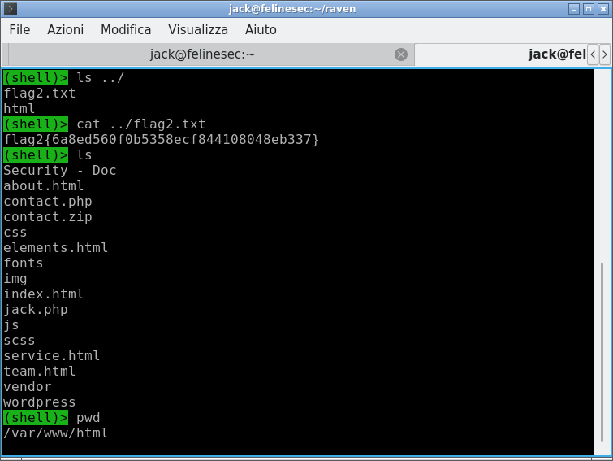

> Terza Flag:
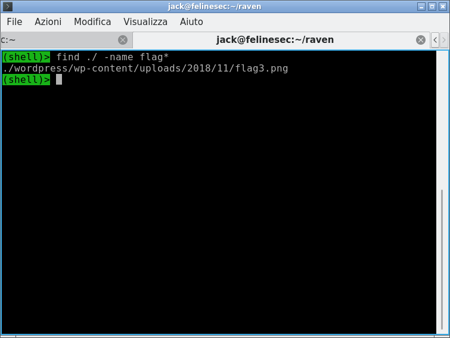

Ad ogni modo, adesso dobbiamo prendere l'ultima flag che risiede nel path `/root/`.

Con `ps -aux | grep root` riesco ad ottenere una lista di processi che runnano come root
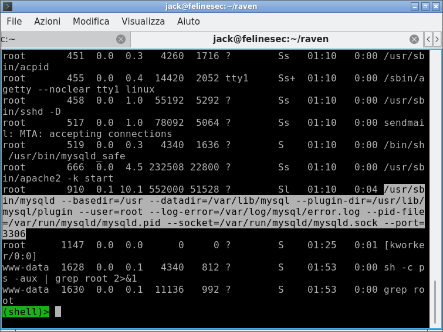

E notiamo che MySQL gira con i permessi di root.

Le credenziali per accedere al database le ho trovate dentro il file di configurazione di wordpress, visto che quest'ultimo ne ha bisogno per comunicare col DB:
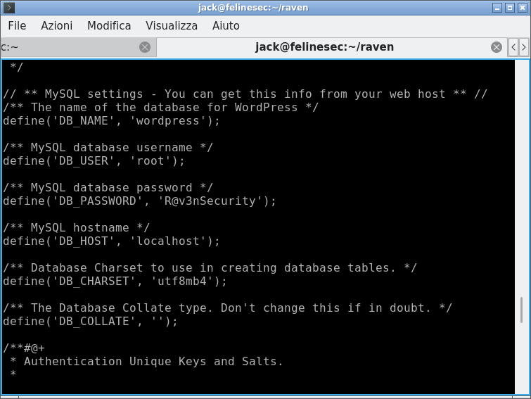

Ma il database è accessibile solo dall'interno della macchina, rifiutando connessioni esterne.

Per questo motivo, ho usato `netcat` per poter creare un tunnel e accedere dall'interno.
Dall'interno della macchina, ho eseguito:
`nc -lvp 1111 -c "nc 127.0.0.1 3306"` in modo tale da reindirizzare tutto il traffico in entrata alla porta 1111 verso la porta interna 3306.

> Successivamente, sulla mai macchina ho eseguito `mysql -p -u root -P 1111 -h raven`
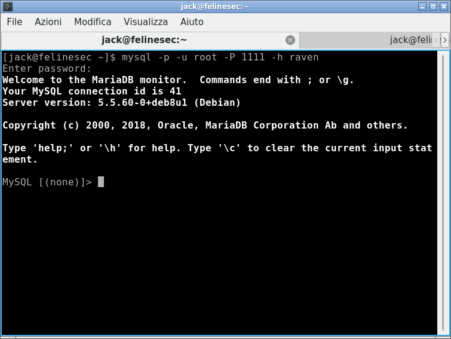 

> Da quì potreste trovare il modo per ottenere una > reverseshell, ma lascio a voi questo modo. Trovate quello più fantasioso e fatemi sapere :')

> Otteniamo l'ultima flag con la query `SELECT load_file(/root/flag4.txt)`
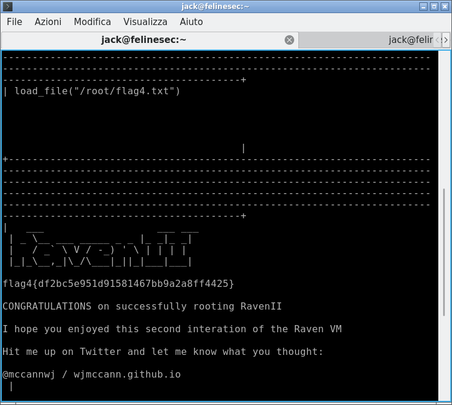

E buonanotte a tutti. :')
